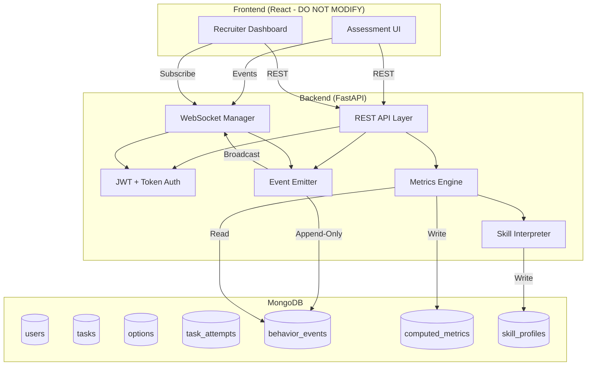
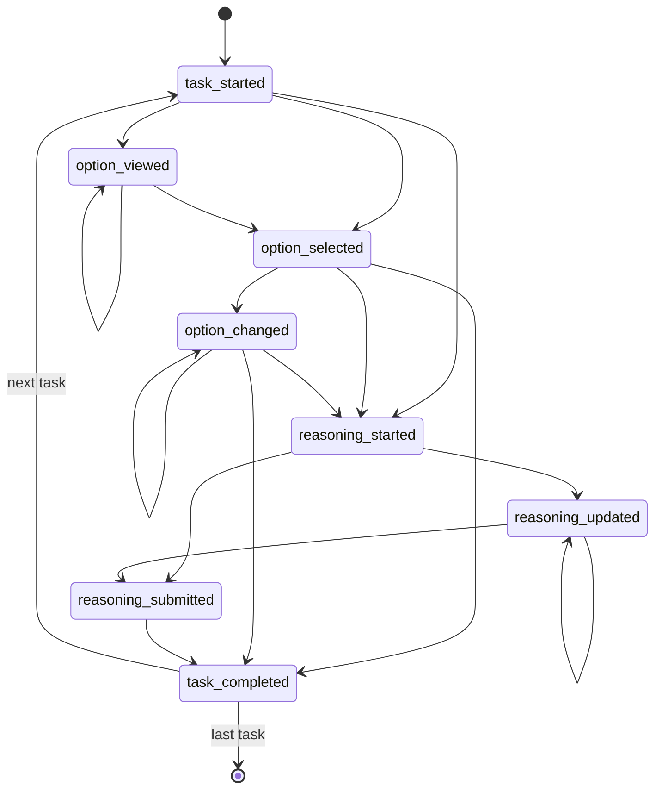

# HireMate Backend Architecture - Behavior-Based Skill Observation System

## Overview

This document defines the complete backend architecture for the HireMate assessment platform. The system observes **behavioral patterns** during micro decision-making tasks and produces explainable skill insights—without any "correct" or "wrong" answers.

> [!IMPORTANT]
> This is NOT a quiz system. There are no scores. The backend observes HOW users solve tasks, not WHAT they answer.

---

## 1. System Architecture



### Core Principles

| Principle | Description |
|-----------|-------------|
| **Append-Only Events** | `behavior_events` is immutable; never update, only insert |
| **Post-Hoc Metrics** | Metrics computed AFTER task completion, never during |
| **Deterministic Logic** | All interpretations use rule-based logic, no ML |
| **Real-Time Broadcast** | Events broadcast immediately to connected clients |
| **Single Source of Truth** | `behavior_events` is authoritative; other collections are derived |

---

## 2. MongoDB Schema Definitions

### 2.1 `users` Collection

```json
{
  "_id": "ObjectId",
  "email": "string (unique, indexed)",
  "password_hash": "string",
  "full_name": "string",
  "role": "enum: ['recruiter', 'admin']",
  "organization_id": "ObjectId | null",
  "created_at": "datetime",
  "updated_at": "datetime",
  "is_active": "boolean"
}
```

### 2.2 `tasks` Collection

Tasks are micro decision-making scenarios. Each task has multiple options with risk metadata.

```json
{
  "_id": "ObjectId",
  "title": "string",
  "description": "string",
  "scenario": "string (the decision-making prompt)",
  "category": "enum: ['problem_solving', 'communication', 'decision_confidence', 'analytical_thinking', 'speed_accuracy']",
  "difficulty": "enum: ['easy', 'medium', 'hard']",
  "time_limit_seconds": "integer | null",
  "options": [
    {
      "id": "string (unique within task, e.g., 'opt_1')",
      "text": "string",
      "risk_level": "enum: ['low', 'medium', 'high']",
      "behavioral_tags": ["string"]  // e.g., ["decisive", "collaborative", "cautious"]
    }
  ],
  "reasoning_required": "boolean",
  "reasoning_min_length": "integer (default: 20)",
  "created_by": "ObjectId (ref: users)",
  "created_at": "datetime",
  "updated_at": "datetime",
  "is_active": "boolean"
}
```

> [!NOTE]
> Options have **risk_level** and **behavioral_tags** but NO correctness value. This is crucial for behavioral observation.

### 2.3 `task_attempts` Collection

Represents a single assessment session for a candidate.

```json
{
  "_id": "ObjectId",
  "token": "string (unique, indexed, one-time use)",
  "candidate_info": {
    "name": "string",
    "email": "string",
    "phone": "string | null",
    "position": "string",
    "resume_url": "string | null"
  },
  "task_ids": ["ObjectId (ref: tasks)"],
  "created_by": "ObjectId (ref: users)",
  "status": "enum: ['pending', 'in_progress', 'completed', 'expired', 'locked']",
  "started_at": "datetime | null",
  "completed_at": "datetime | null",
  "expires_at": "datetime",
  "current_task_index": "integer",
  "locked_at": "datetime | null",
  "locked_reason": "string | null",
  "created_at": "datetime",
  "updated_at": "datetime"
}
```

**Token Security Rules:**
- Token is cryptographically secure (32+ bytes)
- Token becomes invalid after first use (transitions from `pending` → `in_progress`)
- Attempt is locked after `completed` or `expired`
- No re-attempts allowed

### 2.4 `behavior_events` Collection (Core Data - Append Only)

```json
{
  "_id": "ObjectId",
  "attempt_id": "ObjectId (ref: task_attempts, indexed)",
  "task_id": "ObjectId (ref: tasks, indexed)",
  "event_type": "enum: ['task_started', 'option_viewed', 'option_selected', 'option_changed', 'reasoning_started', 'reasoning_updated', 'reasoning_submitted', 'task_completed', 'idle_detected', 'focus_lost', 'focus_gained']",
  "timestamp": "datetime (server-side, indexed)",
  "sequence_number": "integer (auto-increment per attempt)",
  "payload": {
    // Event-specific data (see Event Payload Schemas below)
  },
  "client_timestamp": "datetime | null (from frontend, for reference only)",
  "metadata": {
    "user_agent": "string | null",
    "ip_hash": "string | null"  // hashed for privacy
  }
}
```

**Indexes:**
- `{ attempt_id: 1, sequence_number: 1 }` (unique)
- `{ attempt_id: 1, task_id: 1, timestamp: 1 }`
- `{ event_type: 1, timestamp: -1 }`

### 2.5 `computed_metrics` Collection

Derived metrics computed after task completion.

```json
{
  "_id": "ObjectId",
  "attempt_id": "ObjectId (ref: task_attempts, indexed, unique)",
  "computed_at": "datetime",
  "version": "string",  // metric computation version for reproducibility
  "global_metrics": {
    "total_time_seconds": "float",
    "active_interaction_time_seconds": "float",
    "hesitation_time_seconds": "float",
    "total_tasks": "integer",
    "tasks_completed": "integer",
    "avg_time_per_task_seconds": "float"
  },
  "per_task_metrics": [
    {
      "task_id": "ObjectId",
      "time_spent_seconds": "float",
      "hesitation_seconds": "float",
      "first_decision_speed_seconds": "float",
      "decision_change_count": "integer",
      "final_option_id": "string",
      "final_option_risk_level": "enum: ['low', 'medium', 'high']",
      "reasoning_depth_score": "float",
      "reasoning_word_count": "integer",
      "reasoning_logical_keywords_count": "integer",
      "idle_time_seconds": "float",
      "focus_loss_count": "integer"
    }
  ],
  "aggregated_patterns": {
    "risk_preference": {
      "low_count": "integer",
      "medium_count": "integer", 
      "high_count": "integer",
      "dominant": "enum: ['low', 'medium', 'high', 'balanced']"
    },
    "decision_consistency": "float (0-1)",
    "reasoning_engagement": "float (0-1)",
    "attention_stability": "float (0-1)"
  }
}
```

### 2.6 `skill_profiles` Collection

Human-readable skill interpretations.

```json
{
  "_id": "ObjectId",
  "attempt_id": "ObjectId (ref: task_attempts, indexed, unique)",
  "metrics_id": "ObjectId (ref: computed_metrics)",
  "generated_at": "datetime",
  "version": "string",  // interpretation logic version
  "thinking_style": {
    "primary": "enum: ['analytical', 'intuitive', 'exploratory', 'methodical']",
    "confidence": "float (0-1)",
    "evidence": ["string"]  // human-readable justifications
  },
  "decision_pattern": {
    "speed": "enum: ['fast', 'moderate', 'deliberate']",
    "consistency": "enum: ['steady', 'variable', 'improving']",
    "confidence": "float (0-1)",
    "evidence": ["string"]
  },
  "risk_orientation": {
    "preference": "enum: ['risk_averse', 'balanced', 'risk_tolerant']",
    "confidence": "float (0-1)",
    "evidence": ["string"]
  },
  "communication_style": {
    "reasoning_depth": "enum: ['brief', 'moderate', 'detailed']",
    "logical_structure": "enum: ['informal', 'semi_structured', 'structured']",
    "confidence": "float (0-1)",
    "evidence": ["string"]
  },
  "overall_summary": "string (recruiter-friendly paragraph)",
  "strengths": ["string"],
  "considerations": ["string"]  // NOT weaknesses, neutral observations
}
```

---

## 3. Event Payload Schemas

Each `event_type` has a specific payload structure:

### `task_started`
```json
{
  "task_index": "integer"
}
```

### `option_viewed`
```json
{
  "option_id": "string",
  "view_duration_ms": "integer | null"
}
```

### `option_selected`
```json
{
  "option_id": "string",
  "is_first_selection": "boolean"
}
```

### `option_changed`
```json
{
  "from_option_id": "string",
  "to_option_id": "string",
  "time_since_last_change_ms": "integer"
}
```

### `reasoning_started`
```json
{
  "time_since_task_start_ms": "integer"
}
```

### `reasoning_updated`
```json
{
  "character_count": "integer",
  "word_count": "integer"
}
```

### `reasoning_submitted`
```json
{
  "final_text": "string",
  "word_count": "integer",
  "character_count": "integer"
}
```

### `task_completed`
```json
{
  "final_option_id": "string",
  "task_duration_ms": "integer"
}
```

### `idle_detected`
```json
{
  "idle_duration_ms": "integer",
  "last_activity_type": "string"
}
```

### `focus_lost` / `focus_gained`
```json
{
  "trigger": "string"  // e.g., "tab_switch", "window_blur"
}
```

---

## 4. REST API Endpoints

### 4.1 Authentication

| Method | Endpoint | Description |
|--------|----------|-------------|
| `POST` | `/api/v1/auth/register` | Register new recruiter |
| `POST` | `/api/v1/auth/login` | Login → JWT token |
| `POST` | `/api/v1/auth/refresh` | Refresh JWT token |
| `GET` | `/api/v1/auth/me` | Get current user info |

### 4.2 Tasks Management (Recruiter)

| Method | Endpoint | Description |
|--------|----------|-------------|
| `GET` | `/api/v1/tasks` | List all tasks |
| `POST` | `/api/v1/tasks` | Create new task |
| `GET` | `/api/v1/tasks/{id}` | Get task details |
| `PUT` | `/api/v1/tasks/{id}` | Update task |
| `DELETE` | `/api/v1/tasks/{id}` | Soft delete task |

### 4.3 Assessment Tokens (Recruiter)

| Method | Endpoint | Description |
|--------|----------|-------------|
| `POST` | `/api/v1/attempts` | Create assessment attempt (returns one-time token) |
| `GET` | `/api/v1/attempts` | List all attempts (paginated) |
| `GET` | `/api/v1/attempts/{id}` | Get attempt details |
| `POST` | `/api/v1/attempts/{id}/lock` | Manually lock an attempt |

### 4.4 Candidate Assessment (Token Auth)

| Method | Endpoint | Description |
|--------|----------|-------------|
| `GET` | `/api/v1/assessment/{token}` | Validate token & get assessment info |
| `POST` | `/api/v1/assessment/{token}/start` | Start assessment (token consumed) |
| `GET` | `/api/v1/assessment/{token}/task/{index}` | Get current task |
| `POST` | `/api/v1/assessment/{token}/complete` | Complete assessment |

### 4.5 Behavior Events

| Method | Endpoint | Description |
|--------|----------|-------------|
| `POST` | `/api/v1/events` | Log single behavior event |
| `POST` | `/api/v1/events/batch` | Log multiple events (batch) |
| `GET` | `/api/v1/attempts/{id}/events` | Get all events for attempt (recruiter) |

### 4.6 Metrics & Skill Profiles (Recruiter)

| Method | Endpoint | Description |
|--------|----------|-------------|
| `GET` | `/api/v1/attempts/{id}/metrics` | Get computed metrics |
| `POST` | `/api/v1/attempts/{id}/metrics/compute` | Trigger metric computation |
| `GET` | `/api/v1/attempts/{id}/skills` | Get skill profile |
| `GET` | `/api/v1/candidates` | List all candidates with skills |
| `GET` | `/api/v1/candidates/{email}` | Get candidate by email |
| `GET` | `/api/v1/compare` | Compare multiple candidates |

### 4.7 Dashboard (Recruiter)

| Method | Endpoint | Description |
|--------|----------|-------------|
| `GET` | `/api/v1/dashboard/stats` | Get dashboard statistics |
| `GET` | `/api/v1/dashboard/activity` | Get recent activity |

---

## 5. WebSocket API

### Connection

```
ws://host/ws/assessment/{token}   # Candidate during assessment
ws://host/ws/live/{attempt_id}    # Recruiter live monitoring
```

### Message Schemas

#### Client → Server (Candidate)

```json
{
  "type": "event",
  "event_type": "option_selected",
  "payload": { ... },
  "client_timestamp": "ISO8601"
}
```

#### Server → Client (Broadcast)

```json
{
  "type": "event_logged",
  "event_id": "ObjectId",
  "event_type": "option_selected",
  "timestamp": "ISO8601",
  "payload": { ... }
}
```

```json
{
  "type": "attempt_status",
  "status": "in_progress",
  "current_task_index": 3,
  "total_tasks": 10
}
```

```json
{
  "type": "assessment_completed",
  "attempt_id": "ObjectId",
  "completed_at": "ISO8601"
}
```

---

## 6. Event Validation Rules

All incoming events MUST pass these validations:

### General Rules

| Rule | Description |
|------|-------------|
| **Valid Attempt** | `attempt_id` must exist and be `in_progress` |
| **Valid Task** | `task_id` must belong to the attempt's task list |
| **Sequence Order** | Events must have monotonically increasing sequence numbers |
| **Timestamp** | Server assigns timestamp; client timestamp is informational only |
| **State Transition** | Events must follow valid state machine (see below) |

### Event State Machine



### Payload Validation

- `option_id` must exist in task's options
- `word_count` must match actual words in `final_text`
- `idle_duration_ms` must be positive
- `task_duration_ms` must be reasonable (< 30 minutes)

---

## 7. Metric Computation Formulas

> [!IMPORTANT]
> All metrics are computed AFTER `task_completed` events, never during the assessment.

### 7.1 Time Metrics

```python
# Total Time
total_time = attempt.completed_at - attempt.started_at

# Active Interaction Time (per task)
active_time = sum(
    interval between consecutive events 
    where interval < IDLE_THRESHOLD_MS (default: 5000)
)

# Hesitation Time
hesitation_time = total_time - active_time

# First Decision Speed (per task)
first_decision_speed = (
    first 'option_selected' event timestamp 
    - 'task_started' event timestamp
)
```

### 7.2 Decision Metrics

```python
# Decision Change Count (per task)
decision_change_count = count(events where type == 'option_changed')

# Decision Consistency (global)
# Measures stability of choices across similar tasks
decision_consistency = 1 - (std_dev(decision_times) / mean(decision_times))
```

### 7.3 Reasoning Metrics

```python
# Logical Keywords (weighted)
LOGICAL_KEYWORDS = {
    'because': 1.0, 'therefore': 1.5, 'however': 1.2,
    'although': 1.2, 'since': 1.0, 'consequently': 1.5,
    'thus': 1.5, 'hence': 1.5, 'whereas': 1.2,
    'firstly': 1.0, 'secondly': 1.0, 'finally': 1.0,
    'if': 0.8, 'then': 0.8, 'assuming': 1.3,
    'considering': 1.2, 'given': 1.0, 'implies': 1.5
}

def calculate_reasoning_depth(text):
    word_count = len(text.split())
    keyword_score = sum(
        LOGICAL_KEYWORDS.get(word.lower(), 0) 
        for word in text.split()
    )
    
    # Normalize to 0-1 scale
    word_factor = min(word_count / 100, 1.0)  # Cap at 100 words
    keyword_factor = min(keyword_score / 10, 1.0)  # Cap at 10 points
    
    return (word_factor * 0.4) + (keyword_factor * 0.6)
```

### 7.4 Risk Behavior

```python
# Risk Preference (aggregated)
def calculate_risk_preference(per_task_metrics):
    risk_counts = {'low': 0, 'medium': 0, 'high': 0}
    
    for task in per_task_metrics:
        risk_counts[task.final_option_risk_level] += 1
    
    total = sum(risk_counts.values())
    
    # Determine dominant pattern
    if risk_counts['low'] > total * 0.6:
        dominant = 'low'
    elif risk_counts['high'] > total * 0.6:
        dominant = 'high'
    elif abs(risk_counts['low'] - risk_counts['high']) < total * 0.2:
        dominant = 'balanced'
    else:
        dominant = 'medium'
    
    return {
        'low_count': risk_counts['low'],
        'medium_count': risk_counts['medium'],
        'high_count': risk_counts['high'],
        'dominant': dominant
    }
```

---

## 8. Skill Interpretation Rules

All skill interpretations are **deterministic** and **explainable**.

### 8.1 Thinking Style

```python
def interpret_thinking_style(metrics):
    avg_hesitation = metrics.global_metrics.hesitation_time_seconds / metrics.global_metrics.total_tasks
    avg_changes = sum(t.decision_change_count for t in metrics.per_task_metrics) / len(metrics.per_task_metrics)
    avg_reasoning_depth = sum(t.reasoning_depth_score for t in metrics.per_task_metrics) / len(metrics.per_task_metrics)
    
    if avg_hesitation > 30 and avg_reasoning_depth > 0.7:
        return {
            'primary': 'analytical',
            'confidence': 0.85,
            'evidence': [
                f'High deliberation time (avg {avg_hesitation:.1f}s per task)',
                f'Strong reasoning depth ({avg_reasoning_depth:.0%})'
            ]
        }
    elif avg_hesitation < 10 and avg_changes > 2:
        return {
            'primary': 'exploratory',
            'confidence': 0.8,
            'evidence': [
                f'Quick initial decisions (avg {avg_hesitation:.1f}s)',
                f'Multiple option changes (avg {avg_changes:.1f} per task)'
            ]
        }
    elif avg_hesitation < 15 and avg_changes < 1:
        return {
            'primary': 'intuitive',
            'confidence': 0.75,
            'evidence': [
                f'Fast decision-making (avg {avg_hesitation:.1f}s)',
                f'Minimal revision ({avg_changes:.1f} changes per task)'
            ]
        }
    else:
        return {
            'primary': 'methodical',
            'confidence': 0.7,
            'evidence': [
                f'Balanced approach (avg {avg_hesitation:.1f}s deliberation)',
                f'Moderate adjustments ({avg_changes:.1f} changes per task)'
            ]
        }
```

### 8.2 Risk Orientation

```python
def interpret_risk_orientation(risk_preference):
    if risk_preference.dominant == 'low':
        return {
            'preference': 'risk_averse',
            'confidence': risk_preference.low_count / (risk_preference.low_count + risk_preference.medium_count + risk_preference.high_count),
            'evidence': [
                f'Selected low-risk options in {risk_preference.low_count} tasks',
                'Prefers cautious, safe approaches'
            ]
        }
    elif risk_preference.dominant == 'high':
        return {
            'preference': 'risk_tolerant',
            'confidence': risk_preference.high_count / (risk_preference.low_count + risk_preference.medium_count + risk_preference.high_count),
            'evidence': [
                f'Selected high-risk options in {risk_preference.high_count} tasks',
                'Comfortable with bold decisions'
            ]
        }
    else:
        return {
            'preference': 'balanced',
            'confidence': 0.6,
            'evidence': [
                'No strong preference for risk level',
                'Adapts approach based on context'
            ]
        }
```

### 8.3 Communication Style (Reasoning Analysis)

```python
def interpret_communication_style(metrics):
    avg_word_count = sum(t.reasoning_word_count for t in metrics.per_task_metrics) / len(metrics.per_task_metrics)
    avg_logical_keywords = sum(t.reasoning_logical_keywords_count for t in metrics.per_task_metrics) / len(metrics.per_task_metrics)
    
    # Reasoning depth classification
    if avg_word_count > 50:
        depth = 'detailed'
    elif avg_word_count > 25:
        depth = 'moderate'
    else:
        depth = 'brief'
    
    # Logical structure classification
    if avg_logical_keywords > 3:
        structure = 'structured'
    elif avg_logical_keywords > 1:
        structure = 'semi_structured'
    else:
        structure = 'informal'
    
    return {
        'reasoning_depth': depth,
        'logical_structure': structure,
        'confidence': 0.8,
        'evidence': [
            f'Average {avg_word_count:.0f} words per explanation',
            f'Uses {avg_logical_keywords:.1f} logical connectors per response'
        ]
    }
```

### 8.4 Overall Summary Generation

```python
def generate_summary(thinking_style, decision_pattern, risk_orientation, communication_style):
    templates = {
        ('analytical', 'risk_averse'): "This candidate demonstrates a thoughtful, analytical approach to problem-solving. They take time to consider options carefully and prefer lower-risk solutions with well-structured reasoning.",
        ('intuitive', 'risk_tolerant'): "This candidate shows confident, intuitive decision-making. They commit to choices quickly and are comfortable with higher-stakes options, suggesting comfort with ambiguity.",
        ('exploratory', 'balanced'): "This candidate exhibits an exploratory thinking style, testing multiple possibilities before settling. They show flexibility across risk levels, adapting their approach to context.",
        # ... more templates
    }
    
    key = (thinking_style.primary, risk_orientation.preference)
    return templates.get(key, generate_default_summary(...))
```

---

## 9. Security Implementation

### 9.1 JWT Authentication

```python
# JWT Configuration
JWT_SECRET = env("JWT_SECRET")  # 256-bit minimum
JWT_ALGORITHM = "HS256"
JWT_ACCESS_TOKEN_EXPIRE_MINUTES = 30
JWT_REFRESH_TOKEN_EXPIRE_DAYS = 7
```

### 9.2 One-Time Assessment Tokens

```python
import secrets

def generate_assessment_token():
    return secrets.token_urlsafe(32)  # 256 bits of entropy

def validate_token(token):
    attempt = db.task_attempts.find_one({'token': token})
    
    if not attempt:
        raise InvalidTokenError("Token not found")
    
    if attempt['status'] != 'pending':
        raise TokenAlreadyUsedError("Token has already been used")
    
    if attempt['expires_at'] < datetime.utcnow():
        raise TokenExpiredError("Token has expired")
    
    return attempt
```

### 9.3 Attempt Locking

```python
def lock_attempt(attempt_id, reason="completed"):
    db.task_attempts.update_one(
        {'_id': attempt_id},
        {
            '$set': {
                'status': 'locked',
                'locked_at': datetime.utcnow(),
                'locked_reason': reason
            }
        }
    )
```

---

## 10. Project Structure

```
backend/
├── app/
│   ├── __init__.py
│   ├── main.py                    # FastAPI app entry point
│   ├── config.py                  # Configuration management
│   ├── dependencies.py            # Dependency injection
│   │
│   ├── api/
│   │   ├── __init__.py
│   │   ├── v1/
│   │   │   ├── __init__.py
│   │   │   ├── router.py          # API v1 router aggregation
│   │   │   ├── auth.py            # Authentication endpoints
│   │   │   ├── tasks.py           # Task management
│   │   │   ├── attempts.py        # Assessment attempts
│   │   │   ├── assessment.py      # Candidate assessment flow
│   │   │   ├── events.py          # Behavior event logging
│   │   │   ├── metrics.py         # Computed metrics
│   │   │   ├── skills.py          # Skill profiles
│   │   │   └── dashboard.py       # Dashboard endpoints
│   │   └── websocket/
│   │       ├── __init__.py
│   │       ├── manager.py         # WebSocket connection manager
│   │       ├── assessment_ws.py   # Candidate WebSocket handler
│   │       └── live_ws.py         # Recruiter live monitoring
│   │
│   ├── core/
│   │   ├── __init__.py
│   │   ├── security.py            # JWT, hashing, tokens
│   │   ├── exceptions.py          # Custom exceptions
│   │   └── middleware.py          # Request middleware
│   │
│   ├── db/
│   │   ├── __init__.py
│   │   ├── mongodb.py             # MongoDB connection
│   │   └── indexes.py             # Index creation
│   │
│   ├── models/
│   │   ├── __init__.py
│   │   ├── user.py
│   │   ├── task.py
│   │   ├── attempt.py
│   │   ├── event.py
│   │   ├── metrics.py
│   │   └── skill.py
│   │
│   ├── schemas/
│   │   ├── __init__.py
│   │   ├── user.py                # Pydantic schemas
│   │   ├── task.py
│   │   ├── attempt.py
│   │   ├── event.py
│   │   ├── metrics.py
│   │   └── skill.py
│   │
│   ├── services/
│   │   ├── __init__.py
│   │   ├── auth_service.py
│   │   ├── task_service.py
│   │   ├── attempt_service.py
│   │   ├── event_service.py       # Event logging & validation
│   │   ├── metrics_service.py     # Metric computation engine
│   │   └── skill_service.py       # Skill interpretation engine
│   │
│   └── utils/
│       ├── __init__.py
│       ├── reasoning_analyzer.py  # Text analysis for reasoning
│       └── validators.py          # Custom validators
│
├── tests/
│   ├── __init__.py
│   ├── conftest.py
│   ├── test_auth.py
│   ├── test_events.py
│   ├── test_metrics.py
│   └── test_skills.py
│
├── scripts/
│   ├── seed_tasks.py              # Seed initial tasks
│   └── migrate_indexes.py         # Create/update indexes
│
├── requirements.txt
├── Dockerfile
├── docker-compose.yml
├── .env.example
└── README.md
```

---

## 11. Execution TODO List

### Phase 1: Project Setup
- [ ] Initialize FastAPI project structure
- [ ] Set up MongoDB connection
- [ ] Create `.env` configuration
- [ ] Set up Docker development environment
- [ ] Configure CORS for frontend

### Phase 2: Database Layer
- [ ] Define all Pydantic models
- [ ] Create MongoDB indexes
- [ ] Implement database connection pooling
- [ ] Create seed script for initial tasks

### Phase 3: Authentication
- [ ] Implement user registration
- [ ] Implement JWT login/refresh
- [ ] Implement one-time token generation
- [ ] Implement token validation middleware

### Phase 4: Core API - Tasks & Attempts
- [ ] CRUD endpoints for tasks
- [ ] Create assessment attempt endpoint
- [ ] Token-based assessment retrieval
- [ ] Attempt status management

### Phase 5: Behavior Event System
- [ ] Implement event logging endpoint
- [ ] Implement batch event logging
- [ ] Add event validation rules
- [ ] Add state machine validation
- [ ] Test append-only guarantees

### Phase 6: WebSocket Real-time
- [ ] Implement WebSocket connection manager
- [ ] Implement candidate WebSocket handler
- [ ] Implement recruiter live monitoring
- [ ] Test event broadcasting

### Phase 7: Metrics Engine
- [ ] Implement time metrics computation
- [ ] Implement decision metrics
- [ ] Implement reasoning analysis
- [ ] Implement risk behavior analysis
- [ ] Create metrics computation trigger

### Phase 8: Skill Interpretation
- [ ] Implement thinking style rules
- [ ] Implement risk orientation rules
- [ ] Implement communication style rules
- [ ] Implement summary generation
- [ ] Test deterministic outputs

### Phase 9: Dashboard & Reports
- [ ] Implement dashboard statistics
- [ ] Implement activity feed
- [ ] Implement candidate comparison
- [ ] Add export functionality

### Phase 10: Testing & Deployment
- [ ] Write unit tests for metrics
- [ ] Write unit tests for skill interpretation
- [ ] Write integration tests for full flow
- [ ] Configure Render deployment
- [ ] Set up production MongoDB Atlas

---

## User Review Required

> [!WARNING]
> **Risk Level Tags**: The interpretation system assumes each option has a `risk_level` tag (`low`, `medium`, `high`). You need to confirm:
> 1. Should risk levels be assigned manually when creating tasks?
> 2. Or should I provide default mappings for the existing mock questions?

> [!IMPORTANT]
> **Reasoning Keyword Dictionary**: The current list includes English logical connectors. Should this support multiple languages?

> [!CAUTION]
> **Token Expiration**: I've assumed tokens expire after 7 days by default. Is a different expiration policy needed?

---

## Verification Plan

### Automated Tests
```bash
# Run all tests
pytest tests/ -v

# Run specific test suites
pytest tests/test_metrics.py -v
pytest tests/test_skills.py -v
```

### Manual Verification
1. Create a task attempt via API
2. Complete assessment via WebSocket (simulated events)
3. Verify events stored in MongoDB
4. Trigger metric computation
5. Verify skill profile generation
6. Confirm recruiter dashboard shows data

---

**Awaiting your approval to proceed with implementation.**
